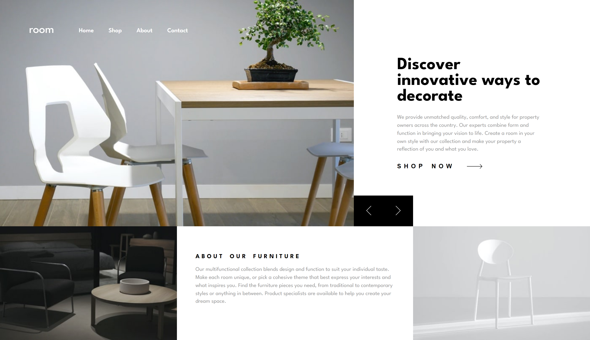

# Frontend Mentor - Room homepage solution

This is a solution to the [Room homepage challenge on Frontend Mentor](https://www.frontendmentor.io/challenges/room-homepage-BtdBY_ENq). Frontend Mentor challenges help you improve your coding skills by building realistic projects. 

## Table of contents

- [Overview](#overview)
  - [The challenge](#the-challenge)
  - [Screenshot](#screenshot)
  - [Links](#links)
- [My process](#my-process)
  - [Built with](#built-with)
- [Author](#author)

## Overview

### The challenge

Users should be able to:

- View the optimal layout for the site depending on their device's screen size
- See hover states for all interactive elements on the page
- Navigate the slider using either their mouse/trackpad or keyboard

### Screenshot

### Links

- Solution URL: [Add solution URL here](https://github.com/mostafa-meerzad/room-homepage)
- Live Site URL: [Add live site URL here](https://gorgeous-kelpie-3e3426.netlify.app/)

## My process

### Built with

- Semantic HTML5 markup
- CSS custom properties
- Flexbox
- CSS Grid
- Mobile-first workflow
- [React](https://reactjs.org/) - JS library
- [framer-motion](https://www.framer.com/motion/) - motion library

### What I learned
How to use HTML aria-lable attribute and make more accessible webpages

## Author

- Frontend Mentor - [@mostafa-meerzad](https://www.frontendmentor.io/profile/mostafa-meerzad)
- Github - [mostafa-meerzad](https://github.com/mostafa-meerzad)
- Instagram - [mostafa-meerzad](https://www.instagram.com/mostafameerzad/)
- linkedIn - [mostafa-meerzad-a753371b7](https://www.linkedin.com/in/mostafa-meerzad-a753371b7)

